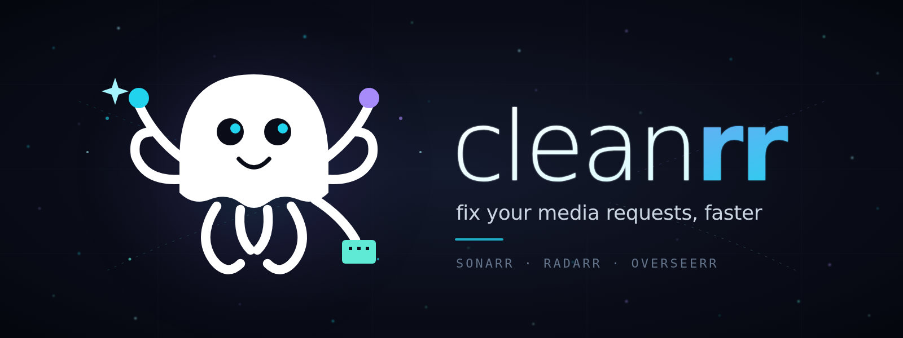

<p align="center">
  
</p>

<p align="center">
  <a href="https://github.com/RayanAlyasi/cleanrr/actions"></a>
  <a href="https://github.com/RayanAlyasi/cleanrr/releases"></a>
  <a href="LICENSE"></a>
  <a href="https://github.com/RayanAlyasi/cleanrr/stargazers"></a>
  <a href="https://www.python.org/"></a>
  <a href="https://github.com/RayanAlyasi/cleanrr/pkgs/container/cleanrr"></a>
</p>

A Telegram bot that lets your friends and family fix their own media issues on your homelab instead of pinging you.

cleanrr sits next to your Sonarr / Radarr / Overseerr / qBittorrent stack and answers natural-language questions ("where's my movie?", "why is this stuck?") by reasoning over your stack with Claude. Eventually it can also take fix actions — re-search a stuck request, remove a stalled torrent, retry an import — with permission.

> **Status:** alpha. Phase 5 of 6 complete (Telegram bot + Claude Agent SDK chat + `/link` identity flow + read-only tools + destructive actions behind confirmation). Expect breaking changes pre-1.0.

## Why this exists

If you run an *arr stack for friends and family, you already know the failure mode: someone requests a movie via Overseerr, it gets stuck somewhere between Radarr / qBittorrent / your import folder, and you become the bottleneck. Existing tools (Maintainerr, Decluttarr, properly-configured TRaSH guides) eliminate most of these — but residual cases still bounce back to the admin.

cleanrr is the conversational layer for those residual cases. The friend asks the bot. The bot diagnoses. If a fix exists, the bot does it (with confirmation for anything destructive).

## What it does today

- Runs as a Docker service on the same network as your existing media stack.
- Accepts Telegram DMs from any user, replies via Claude (model configurable — defaults to Sonnet).
- Maintains a per-user conversation session so follow-up questions retain context.
- Identity: admin issues one-time codes via `/invite`; friends bind their Telegram account to an Overseerr user via `/link`. Stored in SQLite, persists across restarts.
- Request lookup via Overseerr — full list or fuzzy-match a single title.
- TV show status via Sonarr — see what's downloaded and what's downloading.
- Movie status via Radarr — see what's downloaded and what's downloading.
- Stalled-torrent diagnostics via qBittorrent — admin-only "what's stuck?" check.
- Cancel one of your own Overseerr requests via a chat-confirmation flow (Confirm / Cancel buttons).
- Re-trigger a Radarr / Sonarr search on one of your own stuck requests (owner-scoped, confirmation-gated).
- Admin: delete a stalled torrent and its files from qBittorrent (admin-only, confirmation-gated).

## Commands

| Command | Who | Purpose |
| --- | --- | --- |
| `/start` | Anyone | Sanity check; bot confirms it's online. |
| `/help` | Anyone | List the commands available. |
| `/link <code>` | Anyone | Redeem a one-time code to bind your Telegram account to an Overseerr user. |
| `/invite <overseerr_username>` | Admin only | Issue a one-time link code for a friend. Requires `ADMIN_TELEGRAM_IDS` set. |

## Destructive actions

When the bot is about to do something destructive, it posts a Telegram message describing the action with two inline buttons: **Confirm** and **Cancel**. Nothing happens until you tap one. If you don't tap anything within `CONFIRMATION_TTL_SECONDS` (default `60`), the prompt times out and denies the action.

Ownership is double-checked at the tool layer: you can only cancel or re-search requests that Overseerr lists as yours. Deleting a torrent is admin-only.

| Action | Who | Tool |
| --- | --- | --- |
| Cancel an Overseerr request | Owner | `remove_my_request` |
| Re-trigger a Radarr search | Owner | `force_research_movie` |
| Re-trigger a Sonarr search (whole series) | Owner | `force_research_show` |
| Delete a torrent + files from qBittorrent | Admin | `delete_torrent` |

## What it doesn't do yet

- No proactive notifications when a request changes state (Phase 6).
- No per-user rate limits or admin commands beyond `/invite` (Phase 6).

See [the roadmap](#roadmap) below.

## Quick start

```bash
git clone https://github.com/RayanAlyasi/cleanrr.git
cd cleanrr
cp .env.example .env
# edit .env — minimum: TELEGRAM_BOT_TOKEN + one of the two auth options
docker compose up -d --build
```

Then DM your bot on Telegram and say hi.

### Prerequisites

- Docker + Docker Compose
- An existing Docker network your *arr stack lives on (set `DOCKER_NETWORK_NAME` if it isn't named `media`)
- A Telegram bot token from [@BotFather](https://t.me/BotFather)
- **One** of:
  - A Claude.ai OAuth token (recommended for personal use): install [Claude Code](https://code.claude.com/) with `npm install -g @anthropic-ai/claude-code`, then run `claude setup-token` on a machine with browser access and paste the result.
  - An Anthropic API key from [console.anthropic.com](https://console.anthropic.com/) (pay-per-token, no subscription required).

## Configuration

All configuration is via environment variables — no code edits needed. See [`.env.example`](.env.example) for the full set with comments. Summary:

| Variable | Default | Purpose |
| --- | --- | --- |
| `TELEGRAM_BOT_TOKEN` | — | Required. From @BotFather. |
| `CLAUDE_CODE_OAUTH_TOKEN` | — | Auth option A. Subscription-backed. |
| `ANTHROPIC_API_KEY` | — | Auth option B. Pay-per-token. |
| `CLAUDE_MODEL` | `sonnet` | `opus`, `sonnet`, `haiku`, or a full model ID. |
| `CLAUDE_SYSTEM_PROMPT` | built-in | Override the bot's persona without touching code. |
| `ADMIN_TELEGRAM_IDS` | — | Comma-separated Telegram user IDs allowed to run `/invite`. |
| `DATABASE_PATH` | `data/cleanrr.db` | SQLite path for link codes and identity mappings. |
| `LINK_CODE_TTL_HOURS` | `24` | How long link codes remain valid before expiring. |
| `LOG_LEVEL` | `INFO` | `DEBUG`, `INFO`, `WARNING`, `ERROR`. |
| `METRICS_ENABLED` | `false` | Expose Prometheus `/metrics` on `METRICS_PORT`. |
| `METRICS_PORT` | `9100` | Port for the Prometheus metrics HTTP endpoint. |
| `METRICS_BIND_ADDRESS` | `127.0.0.1` | Bind address for Prometheus `/metrics` endpoint. Set to `0.0.0.0` for multi-container scraping. |
| `CLAUDE_TIMEOUT_SECONDS` | `120` | Wall-clock seconds before giving up on a single Claude response. Must exceed `CONFIRMATION_TTL_SECONDS`. |
| `TELEGRAM_MAX_MESSAGE_CHARS` | `2000` | Reject incoming Telegram messages longer than this before they reach Claude. |
| `CONFIRMATION_TTL_SECONDS` | `60` | How long a destructive-action confirmation prompt waits for a button click before timing out. |
| `DOCKER_NETWORK_NAME` | `media` | Used by `docker-compose.yml` to join your existing stack network. |
| `QBITTORRENT_URL` | — | Base URL of your qBittorrent WebUI (e.g. `http://qbittorrent:8080`). |
| `QBITTORRENT_USERNAME` | — | qBittorrent WebUI username. |
| `QBITTORRENT_PASSWORD` | — | qBittorrent WebUI password. |
| `QBITTORRENT_TIMEOUT_SECONDS` | `10` | HTTP timeout for qBittorrent API calls in seconds. |

### Metrics (optional)

Set `METRICS_ENABLED=true` to expose a Prometheus `/metrics` endpoint on `METRICS_PORT` (default `9100`). Import `assets/grafana/cleanrr.json` into Grafana for a ready-made dashboard.

## Architecture

```
Telegram user ──DM──> Telegram API ──> cleanrr (Docker)
                                          │
                                          ├─ Claude Agent SDK ── reasoning
                                          │
                                          └─ tool layer (Phase 4+) ──> Sonarr / Radarr
                                                                       Overseerr
                                                                       qBittorrent
```

Single Python process, single container. Tools are defined as in-process `@tool` functions on the Agent SDK — no separate MCP server processes to run.

### Project layout

```
cleanrr/
├── __main__.py        # entrypoint (python -m cleanrr)
├── bot.py             # Telegram handlers + application wiring
├── agent.py           # ClaudeSDKClient wrapper with per-user sessions
├── identity.py        # SQLite link-code store + Telegram↔Overseerr mapping
├── metrics.py         # Prometheus metrics (opt-in)
└── config.py          # pydantic-settings + auth validation
```

## Roadmap

- [x] **Phase 1** — Project scaffold, Docker, echo bot
- [x] **Phase 2** — Claude Agent SDK integration (chat works)
- [x] **Phase 3** — `/link` identity flow + SQLite mapping
- [x] **Phase 4** — Read-only tools (Overseerr / Sonarr / Radarr / qBittorrent status)
- [x] **Phase 5** — Write tools behind in-chat confirmation (cancel request, delete torrent, force re-search movie/show)
- [ ] **Phase 6** — Proactive notifications + polish (Maintainerr / Decluttarr alongside, admin commands, per-user rate limits)

### Out of scope (for now)

- **Multi-AI provider support** (OpenAI, Gemini, local Ollama). cleanrr is built on the Claude Agent SDK because it bundles tool execution, per-user sessions, and permission callbacks that we lean on heavily from Phase 4 onward — generic LLM abstractions lose those benefits. Could revisit after Phase 6 if there's real demand.

## A note on Anthropic's terms

The Claude Agent SDK documentation states: *"Anthropic does not allow third party developers to offer claude.ai login or rate limits for their products."* Using **your own** Claude.ai subscription to power **your own** personal homelab bot for **your own** friends is clearly within personal use. Running cleanrr as a hosted multi-tenant service for strangers is not — use the `ANTHROPIC_API_KEY` path with per-user billing for anything that scale-wise looks like a product.

## Contributing

See [CONTRIBUTING.md](CONTRIBUTING.md).

## License

[MIT](LICENSE)
